  <picture>
    <source media="(max-width: 760px) and (prefers-color-scheme: dark)" srcset="./assets/hero/agent-console-v6-mobile-dark.svg">
    <source media="(max-width: 760px)" srcset="./assets/hero/agent-console-v6-mobile-light.svg">
    <source media="(prefers-color-scheme: dark)" srcset="./assets/hero/agent-console-v6-dark.svg">
    <source media="(prefers-color-scheme: light)" srcset="./assets/hero/agent-console-v6-light.svg">
    
  </picture>

≽^•⩊•^≼

  

  

  

 

### 🐾 Stack

<code>// frontend & mobile</code>
  

  
<code>// backend & api</code>
  

  
<code>// database & tools</code>
  

 

### 📊 GitHub Stats

  

 
 

### 📈 Activity

 

### 🌏 Broadcasting From

 

  

thanks for stopping by, nya~ 🐾

